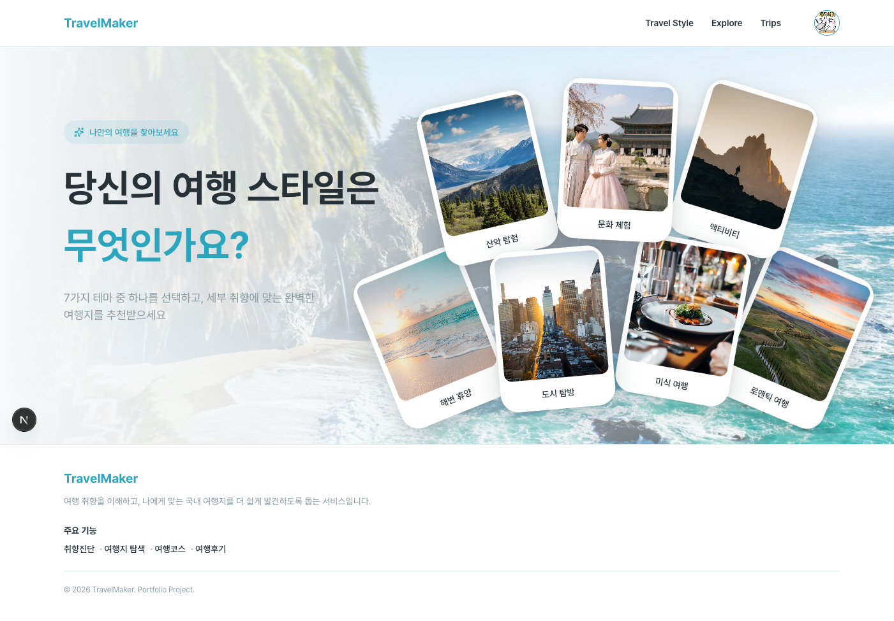
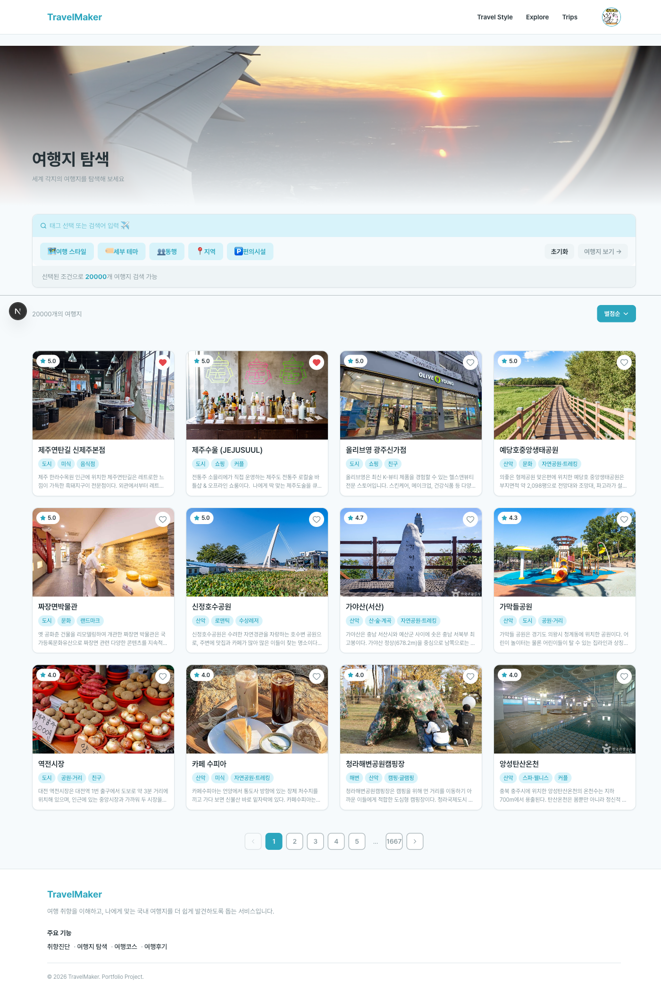
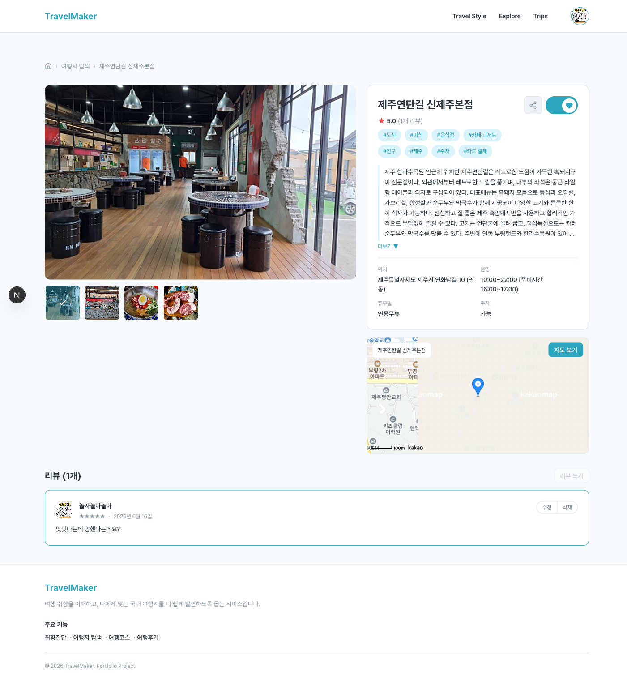
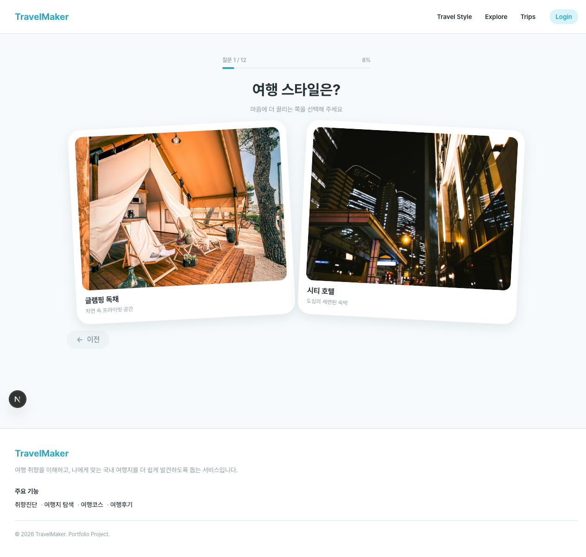
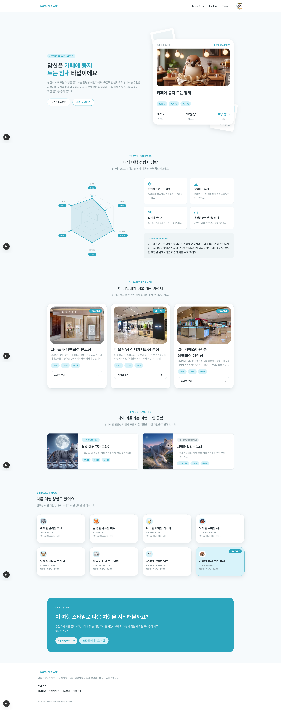
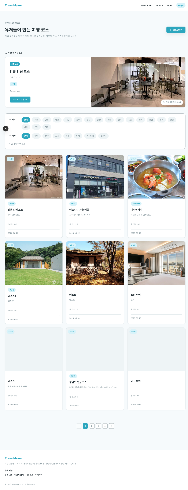
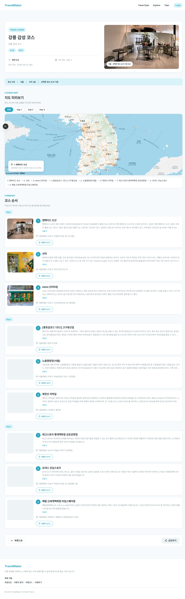
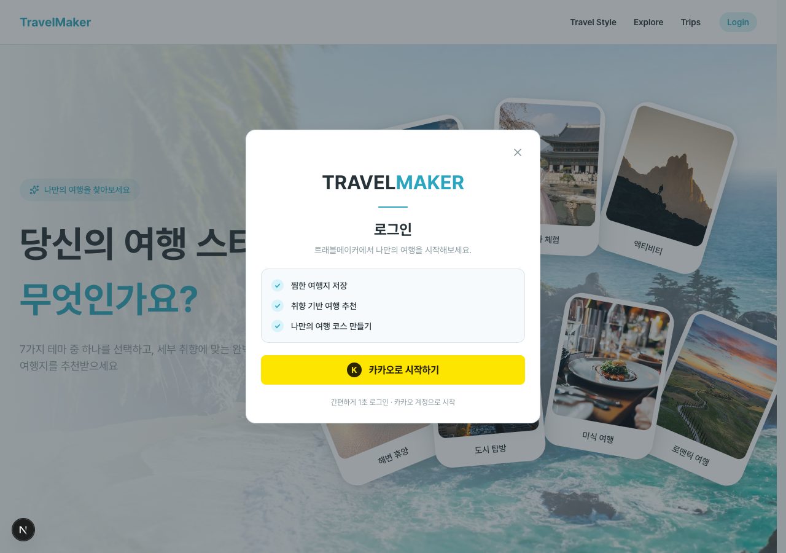
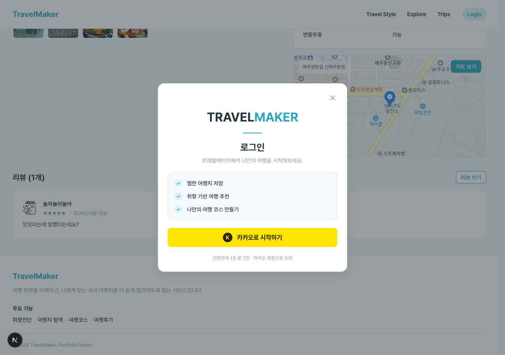
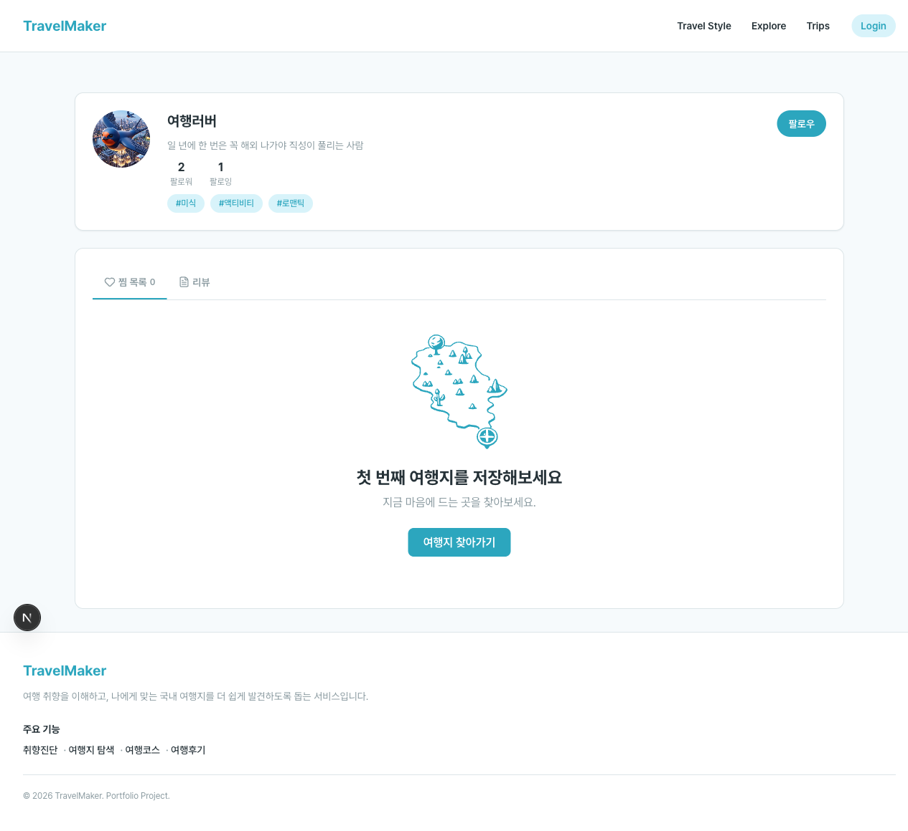

# Travel Maker — Frontend

> 여행 성향 테스트부터 여행지 탐색, 일정 관리까지 제공하는 여행 플랫폼의 프론트엔드 레포지토리

---

## 서비스 소개

**Travel Maker**는 내 여행 취향을 진단하고, 그에 맞는 국내 여행지를 탐색하며, 나만의 여행 코스를 직접 짜볼 수 있는 올인원 여행 플랫폼입니다.

- 7가지 테마 기반의 **여행 성향 테스트**로 나의 여행 스타일을 파악합니다.
- 20,000개 이상의 국내 여행지를 **필터·정렬·검색**으로 빠르게 탐색합니다.
- **드래그 앤 드롭** 방식으로 날짜별 여행 코스를 자유롭게 구성합니다.
- 방문한 여행지에 **리뷰와 별점**을 남기고 다른 여행자의 후기를 확인합니다.
- 마음에 드는 여행지를 **북마크**해 마이페이지에서 한눈에 관리합니다.

---

## 목차

- [주요 기능 미리보기](#주요-기능-미리보기)
- [기술 스택](#기술-스택)
- [시작하기](#시작하기)
- [페이지 구조](#페이지-구조)
- [프로젝트 구조](#프로젝트-구조)
- [아키텍처 원칙](#아키텍처-원칙)
- [네이밍 규칙](#네이밍-규칙)
- [프로젝트 문서](#프로젝트-문서)
- [협업 규칙](#협업-규칙)

---

## 주요 기능 미리보기

### 메인 페이지

카드 클릭 한 번으로 7가지 여행 테마 중 하나를 고르고 관련 여행지 목록으로 바로 이동합니다.



---

### 여행지 탐색 (Explore)

여행 스타일·세부 테마·동행·지역·편의시설 등 다양한 필터를 조합해 20,000개 여행지 중 내 조건에 맞는 곳을 찾습니다.  
별점순·가나다순 정렬을 지원하며, 북마크 버튼으로 즉시 관심 여행지를 저장할 수 있습니다.



---

### 여행지 상세 (Detail)

선택한 여행지의 소개, 카카오맵 위치, 태그, 리뷰 목록을 한 페이지에서 확인합니다.  
별점과 함께 리뷰를 남길 수 있으며, 다른 여행자들의 후기도 모아볼 수 있습니다.



---

### 여행 성향 테스트 (Travel Style)

여행지 선택, 숙소 타입, 동행 스타일 등 일련의 질문에 답변하면 나만의 여행 유형이 산출됩니다.  
결과 URL을 공유하면 친구들과 성향을 비교할 수 있습니다.

|                               테스트 진행                               |                                   결과 확인                                    |
| :---------------------------------------------------------------------: | :----------------------------------------------------------------------------: |
|  |  |

---

### 여행 일정 관리 (Trips)

일정별 여행 코스를 생성하고 장소를 자유롭게 추가합니다.  
드래그 앤 드롭으로 방문 순서를 바꾸고, 지도에서 코스 동선을 한눈에 파악합니다.

|                                  일정 목록                                  |                                일정 상세·코스 편집                                |
| :-------------------------------------------------------------------------: | :-------------------------------------------------------------------------------: |
|  |  |

---

### 로그인 (카카오 OAuth)

카카오 계정 한 번으로 가입·로그인을 완료합니다.  
로그인이 필요한 기능(북마크·리뷰·일정) 사용 시 자동으로 로그인 모달이 표시됩니다.

|                                  로그인 모달                                   |                                 리뷰 작성 시 인증 유도                                 |
| :----------------------------------------------------------------------------: | :------------------------------------------------------------------------------------: |
|  |  |

---

### 마이페이지 (Profile)

북마크한 여행지, 내가 쓴 리뷰, 성향 테스트 결과를 탭으로 나눠 확인합니다.  
닉네임·소개글·프로필 이미지를 수정할 수 있습니다.



---

## 기술 스택

| 분류           | 기술                    | 비고                              |
| -------------- | ----------------------- | --------------------------------- |
| 프레임워크     | Next.js 16 (App Router) | React Server Component 기반       |
| 언어           | TypeScript (strict)     | `any` 사용 금지                   |
| 스타일링       | Panda CSS               | Semantic token 기반 디자인 시스템 |
| 상태 관리      | Zustand                 | 전역 상태 최소화 원칙             |
| HTTP           | Axios                   | 인터셉터로 토큰 주입              |
| 애니메이션     | Framer Motion           | —                                 |
| 드래그 앤 드롭 | dnd-kit                 | 여행 일정 순서 변경               |
| 차트           | Recharts                | 성향 테스트 결과 시각화           |
| Mock API       | MSW                     | 개발 환경 API 목업                |
| 패키지 매니저  | pnpm                    | `pnpm@10.33.0`                    |

---

## 시작하기

https://github.com/Ie-ight/travel-maker-frontend.git clone 받기

### 요구사항

- Node.js 20+
- pnpm 10+

### 1. 의존성 설치

```bash
pnpm install
```

### 2. 환경 변수 설정

`.env.example`을 복사해 `.env.local`을 만들고 값을 채웁니다.

```bash
cp .env.example .env.local
```

| 변수                             | 설명                                          |
| -------------------------------- | --------------------------------------------- |
| `NEXT_PUBLIC_API_URL`            | 백엔드 API 서버 URL                           |
| `NEXT_PUBLIC_KAKAO_CLIENT_ID`    | 카카오 OAuth 앱 키                            |
| `NEXT_PUBLIC_KAKAO_REDIRECT_URI` | 카카오 OAuth 리다이렉트 URI (백엔드 콜백 URL) |
| `NEXT_PUBLIC_KAKAO_MAP_APP_KEY`  | 카카오맵 JavaScript 앱 키                     |

> **주의**: `NEXT_PUBLIC_KAKAO_REDIRECT_URI`는 프론트 경로가 아닌 백엔드 콜백 API URL을 가리킵니다.  
> 카카오 OAuth 흐름은 [인증 흐름 문서](docs/auth-flow.md)를 참고하세요.

### 3. 개발 서버 실행

```bash
pnpm dev
```

[http://localhost:3000](http://localhost:3000)에서 확인할 수 있습니다.  
(`panda codegen`이 먼저 실행된 후 Next.js dev server가 시작됩니다.)

### 빌드 & 프로덕션 실행

```bash
pnpm build   # Panda CSS 코드젠 + Next.js 빌드
pnpm start   # 프로덕션 서버 실행
```

### 기타 명령어

```bash
pnpm lint           # ESLint 검사
pnpm format         # Prettier 포맷 적용
pnpm format:check   # Prettier 포맷 검사만 (수정 없음)
pnpm panda          # Panda CSS 코드젠 (일회성)
pnpm panda:dev      # Panda CSS 코드젠 watch 모드
```

---

## 페이지 구조

| 경로                     | 설명                                        | 인증 필요 |
| ------------------------ | ------------------------------------------- | --------- |
| `/`                      | 메인 페이지 — 추천 여행지, 성향 테스트 진입 | —         |
| `/explore`               | 여행지 탐색 — 필터, 정렬, 북마크            | —         |
| `/detail/[id]`           | 여행지 상세 — 정보, 리뷰, 지도              | —         |
| `/test`                  | 여행 성향 테스트 질문                       | —         |
| `/test/result`           | 성향 테스트 결과 — 공유 가능한 URL          | —         |
| `/trips`                 | 여행 일정 목록                              | -         |
| `/trips/[tripId]`        | 여행 일정 상세                              | -         |
| `/trips/create`          | 여행 일정 생성                              | ✓         |
| `/profile/[userId]`      | 프로필 — 북마크, 내 리뷰, 성향 결과         | ✓         |
| `/profile/[userId]/edit` | 프로필 수정                                 | ✓         |
| `/auth/callback`         | 카카오 로그인 콜백 처리 (토큰 수신)         | —         |

---

## 프로젝트 구조

```text
src/
├── app/                            # Next.js App Router 진입점
│   ├── (main)/                     # 메인 페이지 (/)
│   ├── (pages)/                    # 서비스 페이지 그룹
│   │   ├── explore/                # 여행지 탐색
│   │   ├── detail/[id]/            # 여행지 상세
│   │   ├── test/                   # 성향 테스트
│   │   │   └── result/             # 테스트 결과
│   │   ├── trips/                  # 여행 일정
│   │   │   ├── [tripId]/
│   │   │   │   └── edit/
│   │   │   └── create/
│   │   └── profile/[userId]/       # 프로필
│   │       └── edit/
│   └── auth/callback/              # 카카오 로그인 콜백
│
├── features/                       # 기능 단위 모듈
│   ├── auth/                       # 인증 (OAuth, 토큰, 초기화)
│   │   ├── api/
│   │   ├── components/             # AuthInitializer, LoginModal
│   │   ├── hooks/                  # useInitializeAuth
│   │   ├── store/                  # useAuthStore
│   │   └── utils/                  # tokenStorage
│   ├── explore/                    # 여행지 탐색 (필터, 목록)
│   ├── home/                       # 메인 페이지 섹션
│   ├── mypage/                     # 마이페이지 탭 (북마크, 리뷰, 성향)
│   ├── result/                     # 성향 테스트 결과
│   ├── reviews/                    # 리뷰 작성·조회
│   ├── test/                       # 성향 테스트 질문 흐름
│   ├── travel/detail/              # 여행지 상세 (지도, 리뷰 섹션)
│   └── trips/                      # 여행 일정 (생성·편집·코스)
│       ├── CourseSidePanel/
│       ├── SchedulePanel/
│       └── CourseMapPanel/
│
├── components/                     # 도메인 무관 공용 컴포넌트
│   ├── auth/                       # 인증 공통 UI
│   ├── common/                     # Button, Modal, Toast, Tag 등
│   ├── filters/                    # 필터 카드 UI
│   ├── layout/                     # Header, Footer
│   └── ui/                         # PlaceCard, Skeleton, Pagination
│
├── lib/                            # 외부 라이브러리 설정
│   ├── api.ts                      # Axios 인스턴스 (인터셉터 포함)
│   └── auth.ts                     # 서버 컴포넌트용 인증 유틸
│
├── store/                          # 전역 Zustand 스토어
├── services/                       # 외부 서비스 연동 (카카오 OAuth 등)
├── mocks/                          # MSW 핸들러 & 목업 데이터
├── types/                          # 전역 공용 TypeScript 타입
├── constants/                      # 라우트, 옵션 등 상수
└── utils/                          # 순수 유틸 함수
```

---

## 아키텍처 원칙

### Server / Client Component 분리

`'use client'` 경계는 가능한 한 말단 컴포넌트까지 내립니다.

```text
page.tsx (Server)
  └── ResultPage.tsx (Server)
        └── ChartSection.tsx (Client) ← 여기서만 'use client'
```

| 상황                          | 컴포넌트 종류             |
| ----------------------------- | ------------------------- |
| 데이터 페칭, 서버 리소스      | Server Component (기본값) |
| `useState` / `useEffect` 사용 | Client Component          |
| 이벤트 핸들러, 브라우저 API   | Client Component          |
| Zustand / Recharts 직접 사용  | Client Component          |

### TypeScript 타입 사용 기준

| 상황             | 사용        |
| ---------------- | ----------- |
| 객체 데이터 구조 | `type`      |
| API 응답 타입    | `type`      |
| 컴포넌트 Props   | `interface` |
| Union 타입       | `type`      |

### 인증 흐름 요약

1. 카카오 로그인 → 백엔드 OAuth 처리 → `/auth/callback?access_token=...` 리다이렉트
2. `access_token`은 Zustand store에만 저장 (localStorage 미사용)
3. `refresh_token`은 HttpOnly Cookie로 관리 — 새로고침 시 `/auth/token/refresh`로 복구
4. Axios 인터셉터가 store의 token을 읽어 `Authorization: Bearer` 헤더를 자동으로 추가

자세한 내용은 [인증 흐름 문서](docs/auth-flow.md)를 참고하세요.

---

## 네이밍 규칙

### 파일 / 폴더

| 대상               | 형식                       | 예시              |
| ------------------ | -------------------------- | ----------------- |
| 컴포넌트 파일·폴더 | PascalCase                 | `LoginForm.tsx`   |
| 페이지 컴포넌트    | PascalCase + `Page` suffix | `ExplorePage.tsx` |
| 훅                 | camelCase + `use` prefix   | `useAuth.ts`      |
| 스토어             | camelCase + `Store` suffix | `authStore.ts`    |
| 유틸 / 헬퍼        | camelCase                  | `formatDate.ts`   |
| 타입 파일          | camelCase + `.types`       | `user.types.ts`   |
| 일반 폴더          | kebab-case                 | `design-tokens/`  |

### API 함수

| HTTP 메서드 | 형식            | 예시                 |
| ----------- | --------------- | -------------------- |
| GET         | `get` + 명사    | `getTravelDetail`    |
| POST        | `post` + 명사   | `postRecommendation` |
| PATCH       | `patch` + 명사  | `patchUserProfile`   |
| DELETE      | `delete` + 명사 | `deleteSavedTravel`  |

---

## 프로젝트 문서

| 문서                                      | 내용                                                         |
| ----------------------------------------- | ------------------------------------------------------------ |
| [인증 흐름](docs/auth-flow.md)            | 카카오 OAuth 흐름, 토큰 관리, 초기화 순서, 디버깅 체크리스트 |
| [라우팅 가이드](docs/ROUTING.md)          | App Router 구조, 페이지별 상세 설명, 구현 주의사항           |
| [디자인 시스템](docs/design-system.md)    | 컬러 토큰, Panda CSS 사용 기준, 토큰 네이밍 원칙             |
| [AI 코딩 가이드](docs/ai-coding-guide.md) | 스타일 작업 규칙, Panda token 사용 예시                      |

---

## 협업 규칙

### 브랜치 전략

git flow 전략 사용하고 있습니다

- `main` — 프로덕션 배포 브랜치 (직접 push 금지)
- `develop` — 통합 개발 브랜치 (**PR base는 항상 `develop`**)
- `feature/이슈번호-설명` — 기능 개발
- `fix/이슈번호-설명` — 버그 수정

### 커밋 메시지

타입: 변경사항

```text
feat: 여행지 상세 페이지 북마크 기능 추가
fix: 카카오 로그인 콜백 토큰 누락 버그 수정
refactor: PlaceCard 컴포넌트 Server Component로 전환
chore: pnpm 버전 업그레이드
```

[Conventional Commits](https://www.conventionalcommits.org/) 형식을 따릅니다.

### PR 규칙

- base 브랜치는 반드시 `develop`
- `.github/PULL_REQUEST_TEMPLATE.md` 형식 사용
- 체크리스트: 동작 확인 / `console.log` 제거 / 컨벤션 준수

### lint & format

커밋 시 husky + lint-staged가 자동으로 실행됩니다.

```bash
pnpm lint           # ESLint 검사
pnpm format         # Prettier 포맷 적용
pnpm format:check   # 포맷 검사만
```
